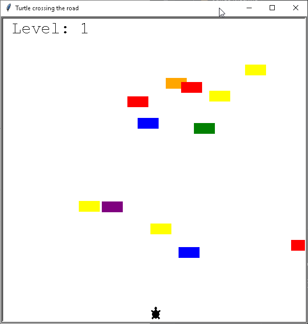

# 🐢 Turtle Crossing Game

Welcome to the **Turtle Crossing Game**! In this fun and engaging Python game, help the turtle cross the road while avoiding oncoming traffic. As you progress, the difficulty increases with faster-moving cars.

---

## 🎮 Game Overview

The objective is to safely guide the turtle from the bottom to the top of the screen without getting hit by cars. Each successful crossing increases the level, making the game more challenging as cars speed up.

---

## ✨ Features

- Move the turtle up and down using the **Up** and **Down** arrow keys.
- Randomly generated cars with different colors.
- Increasing difficulty as levels progress.
- A scoreboard that tracks your current level.
- "Game Over" screen when the turtle collides with a car.

---

## 🚀 How to Play

1. Run `main.py` to start the game.
2. Use the **Up Arrow Key** to move forward and the **Down Arrow Key** to move backward.
3. Avoid the cars while reaching the finish line.
4. Every time you reach the finish line, you level up and the cars move faster.
5. If a car hits the turtle, the game ends.

---

## 🛠️ Requirements

Ensure you have **Python 3.x** installed on your system. This game uses the **turtle** module, which comes pre-installed with Python.

---

## 🎥 Demo

---

## 🏗️ Technologies Used

- **Python**
- **Turtle Module**

---

## 🔮 Future Improvements

- Add sound effects for collisions and level-ups.
- Introduce power-ups or shields to protect the turtle.
- Implement different difficulty levels.

---

👨‍💻 Created by [Tsaousidis](https://github.com/Tsaousidis)  
🎉 Have fun playing! Let me know your thoughts and suggestions! 🎉

